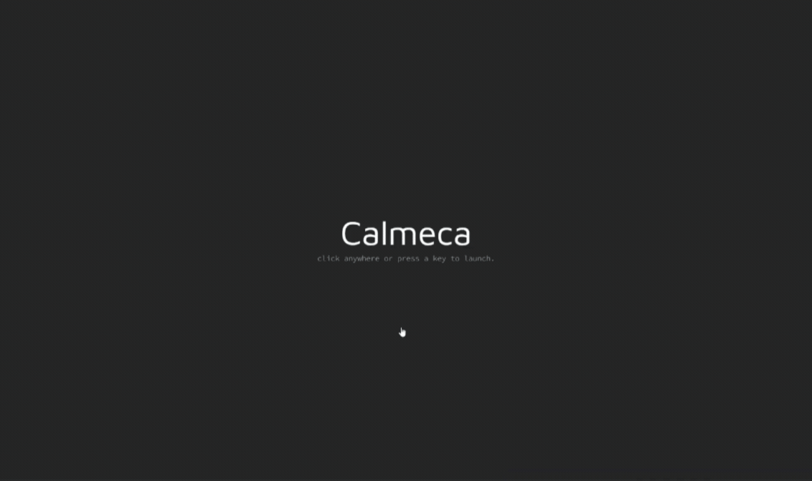

# calmeca

academic productivity app built with NeutralinoJS inteigrating gcalendar and syllabi-based detail extraction

### Status

> - Codebase predominantly completed, patching small bugs and improvements where needed.
> - Optimizing extraction pipeline for efficiency

<details>
  <summary><strong>Table of Contents</strong></summary>
</details>

I built Calmeca because I wanted a tool for organization and course scheduling.




## Overview

Calmeca is an organizational tool targeted towards academics: optimizing course scheduling for exam dates, recurring assignments, and course-specific tasks. It leverages the OpenAI platform for an entity-extraction pipeline for processing course syllabi and extracting key dates and information.

After my first two semesters of university, I learned that syllabus week is a critical time for locking down course dates and organizational principles that retain throughout semester. The process of manually adding course dates into my calendar from the syllabus was notably tedious.

This drove me to create a tool to streamline this process, and eventually, scale it up to a **general** academic productivity app.

Now it's August, and I'm documenting the codebase.

## Features

- Course management with semester tracking, professor/contact details, resources, and exam deadlines
- Syllabus PDF extraction for converting course materials into exam, assignment, and recurring event dates
- Google OAuth and Google Calendar integration for syncing academic events and deadlines
- Task and subtask tracking for assignments, projects, labs, and recurring work items
- Dashboard overview with upcoming deadlines, exams, daily summaries, and calendar-style planning
- Course-specific organization for midterms, finals, office hours, and academic scheduling

## Frameworks & Technologies

- Neutralino & React JS
- Google OAuth 2.0
- Google Calendar API
- OpenAI SDK
- IndexedDB via Dexie JS
- Zod
- TailwindCSS
- Framer Motion
- ShadCN
- PDF-Parse

## Architecture

Calmeca's core (NeutralinoJS) is a lightweight, native C++ binary server that operates on Websockets.

- The architecture follows a _Model-View-Controller_ design and is divided into three distinct parts
  - **Internal Database**
  - **Integrations**
  - **Frontend**

The _internal database layer_ is responsible for object definitions, storage, and principal CRUD operations. External APIs and services are managed in the _integrations_ layer. The core layout, components, and pages are implemented by the _frontend_ layer.

### Internal Database

The foundation of this layer and of the app is IndexedDB, which provides a client-side NO-SQL database system; it is interfaced through Dexie JS for ease of development.

This layer defines and constructs several key objects, such as Course, Task, and Calendar Event interfaces.

<details>
<summary><b>Task Object</b></summary>

```ts
export interface Task {
  id: string;
  summary?: string;
  allDay?: boolean;
  recurring?: boolean;
  reccurrence: string;
  courseId: string;
  title: string;
  type: TaskType;
  deadline?: Date;
  completed: boolean;
  color?: string;
  googleCalendarEventId?: string;
  notes?: string;
  subtasks?: SubTask[];
}
```

</details>

These objects are operated on through synchronous and asynchronous service functions for core operations (CRUD).

<details>
<summary><b>Add Course</b></summary>

```ts
export async function addCourse(
  course: Omit<
    Course,
    "id" | "createdOn" | "updatedOn" | "updatedFrom" | "archived"
  >,
): Promise<Course> {
  const { id, createdOn, updatedOn, updatedFrom, archived, ...rest } =
    course as any;
  const newCourse: Course = {
    ...rest,
    id: generateId(),
    createdOn: new Date(),
    updatedOn: new Date(),
    updatedFrom: undefined,
    archived: false,
    color: course.color || "#ffffffff",
  };

  await db.courses.add(newCourse);
  return newCourse;
}
```

</details>

<details>
<summary><b>Delete Task</b></summary>

```ts
export const deleteTask = async (id: string) => {
  const task = await db.tasks.get(id);
  if (!task) return;

  await db.tasks.delete(id);
  await deleteEvent(task.id);
  if (task.googleCalendarEventId) {
    const { deleteGoogleCalendarEvent } =
      await import("@/lib/helpers/calendarHelpers");
    await deleteGoogleCalendarEvent(task.googleCalendarEventId);
  }
  await updateCourseFromChild("task", task.courseId);
};
```

</details>

This design pattern propagates throughout all of the app's features to form the complete internal database layer.

### Integrations

The purpose of this layer is to provide a platform for external services like Google and OpenAI. It abstracts servicing for workflows like authentication, calendar updates (add, delete, edit), and entity extraction.

#### Google Oauth 2.o\0

The end-to-end authentication flow is natively implemented in the app, including the PCKE flow, token exchange, and session management.

Token management leverages the `Neutralino.storage()` interface.

- **PKCE** involves generating a highly-random string, the _verifier_, and executing a `SHA-256` hash on the verifier to create the _code challenge_.
- The challenge is then sent alongside the initial authorization request to the OAuth 2.0 server to protect public clients against authorization code interception attacks.
- The client sends the verifier during the token exchange; the server hashes it, and if `hash == code challenge`, login tokens are issued.

<details>
  <summary>PKCE Helpers</summary>

```ts
function generateCodeVerifier(): string {
  const arr = new Uint8Array(64);
  crypto.getRandomValues(arr);
  return Array.from(arr, (dec) => dec.toString(16).padStart(2, "0")).join("");
}

async function generateCodeChallenge(verifier: string): Promise<string> {
  const encoder = new TextEncoder();
  const data = encoder.encode(verifier);
  const digest = await crypto.subtle.digest("SHA-256", data);
  return btoa(String.fromCharCode(...new Uint8Array(digest)))
    .replace(/\+/g, "-")
    .replace(/\//g, "_")
    .replace(/=+\$/, "");
}
```

</details>

<details>
  <summary>Login Implementation</summary>

```ts
export async function googleLogin() {
  const verifier = generateCodeVerifier();
  const challenge = await generateCodeChallenge(verifier);
  const state = generateState();

  logAuthDebug("starting login flow", {
    clientIdPresent: Boolean(CLIENT_ID),
    redirectUri: REDIRECT_URI,
    origin: typeof window !== "undefined" ? window.location.origin : undefined,
  });

  if (!CLIENT_ID) {
    const errorMessage =
      "VITE_GOOGLE_CLIENT_ID is missing. Google auth cannot start.";
    console.error(`[google-auth] ${errorMessage}`);
    throw new Error(errorMessage);
  }

  await writeStoredValue("google_code_verifier", verifier);
  await writeStoredValue("google_auth_state", state);

  // clear any stale code from a previous attempt before opening the browser
  try {
    await fetch("http://127.0.0");
  } catch {
    /* server may not be running */
  }

  const authUrl = new URL("https://google.com");
  authUrl.searchParams.set("client_id", CLIENT_ID);
  authUrl.searchParams.set("redirect_uri", REDIRECT_URI);
  authUrl.searchParams.set("response_type", "code");
  authUrl.searchParams.set("scope", SCOPES);
  authUrl.searchParams.set("code_challenge", challenge);
  authUrl.searchParams.set("code_challenge_method", "S256");
  authUrl.searchParams.set("access_type", "offline");
  authUrl.searchParams.set("prompt", "consent");
  authUrl.searchParams.set("include_granted_scopes", "true");
  authUrl.searchParams.set("state", state);

  if (typeof Neutralino !== "undefined") {
    await Neutralino.os.open(authUrl.toString());
    const code = await waitForCallbackCode(state);
    if (!code) {
      throw new Error("timed out waiting for the Google callback.");
    }

    const success = await handleOauthCallback(code, state);
    if (!success) {
      throw new Error("Google authentication failed");
    }
    return;
  } else {
    window.location.href = authUrl.toString();
  }
}
```

</details>

The logout process is simply clearing session tokens from local storage.

<details>
  <summary>Google Logout</summary>

```ts
export async function googleLogout() {
  cachedAccessToken = null;
  cachedRefreshToken = null;

  try {
    await clearStoredValue("google_access_token");
    await clearStoredValue("google_refresh_token");
    await clearStoredValue("google_code_verifier");
    await clearStoredValue("google_auth_state");
  } catch (error) {
    console.error("failed to clear local auth storage on logout", error);
  }
}
```

</details>

#### Google Calendar API

The app interfaces with the Google Calendar API for logging key dates from course data, task deadlines, and other academic dates.

It leverages a wrapper function `apiRequest()` to automatically handle security, authentication, and error checking when using the calendar API.

- Functions for adding, updating, and deleting calendar events are implemented for use in external components like task and event dialogs, and for automatic event insertion when adding courses.
- These functions use `POST`, `PATCH`, and `DELETE` HTTP request methods for updating the user's Google Calendar in real-time.

<details>
<summary><b>Adding a Calendar Event</b></summary>

```typescript
export async function addGoogleCalendarEvent(
  event: GCalEvent,
): Promise<GCalEventResponse | null> {
  const data = await apiRequest<GoogleCalendarEventResponse>(
    `/calendars/primary/events`,
    {
      method: "POST",
      body: JSON.stringify({
        summary: event.summary,
        description: event.description,
        location: event.location,
        start: { dateTime: event.start },
        end: { dateTime: event.end },
      }),
    },
  );

  if (!data) return null;

  return {
    id: data.id,
    summary: data.summary || "",
    start: data.start?.dateTime || data.start?.date || "",
    end: data.end?.dateTime || data.end?.date || "",
    description: data.description,
    location: data.location,
  };
}
```

</details>

#### Extraction (OpenAI)
The extraction layer pulls course data (name, code, description, and credits) and key dates (exams, recurring tasks, and lab times) from user-submitted course syllabi PDFs.
- It uses the `pdf-parse` package and exports a wrapper class `PDFService` that extracts and cleans raw text from the inputted PDF. 
- The raw text is then fed into a `open-ai` wrapper class `ExtractionService` to extract information into a `zod` schema that maps the native `Course` interface, and returns a populated course object. 
  - An additional pre-processing step was implemented for efficiency optimizaiton. 
  - Dates are automatically inserted into the user's Google calendar on submit. 
  - The `gpt-4o-mini` is used. 

### Frontend

The frontend is built with React and Tailwind, wrapped by Neutralino for the desktop experience. It includes the dashboard, course overview, task detail views, and the modal workflows used to add or edit academic data, sync events, and review extracted details.

The UI leans on a dark, glassy, minimal visual system with layered cards, muted neutrals, and high-contrast academic status colors. The app also uses a custom font stack and reusable utility patterns for consistent layout and readability.

```tsx
<div className="min-h-screen bg-zinc-950/70 text-white">
  <div className="rounded-2xl border border-white/10 bg-white/5 p-4 shadow-xl backdrop-blur-xl">
    <h1 className="font-dm text-2xl font-bold">dashboard</h1>
  </div>
</div>
```

```tsx
<button className="rounded-xl bg-primary px-4 py-2 text-primary-foreground hover:opacity-90">
  add course
</button>
```

```tsx
<div className="bg-gradient-to-br from-zinc-900 via-zinc-950 to-black text-zinc-100">
  <span className="text-emerald-400">upcoming</span>
  <span className="text-amber-400">deadline</span>
  <span className="text-rose-400">exam</span>
</div>
```

This keeps the interface consistent across dashboards, course cards, calendar events, and extraction result modals while preserving a desktop-app aesthetic.

## Installation & Usage

### For Use
- on the way

### For Dev
1. Clone the repository and install dependencies:
   ```bash
   npm install
   ```
2. Create a local environment file with the required Google and OpenAI credentials:
   ```bash
   VITE_GOOGLE_CLIENT_ID=
   VITE_GOOGLE_CLIENT_SECRET=
   VITE_GOOGLE_REDIRECT_URI=http://127.0.0.1:8085/callback
   VITE_OPENAI_API_KEY=
   ```
3. Start the development app:
   ```bash
   neu run
   ```

--- 
Jeevan Sanchez, 2026
